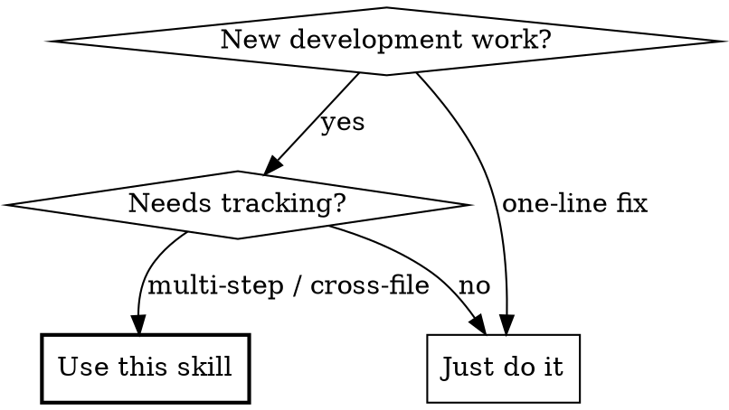
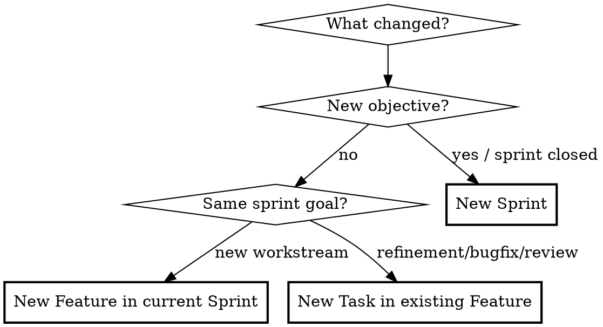

# Sprint Workflow

**Announce at start:** "Using sprint-workflow skill to organize this work."

Track development work at four levels: **Sprint** (business objective) > **Feature** (workstream) > **Task** (execution unit) > **IT** (integration checks).

## When to Use



Do NOT use for: one-line fixes, retroactive rewriting of old sprints unless requested.

## Directory Standard

Target directory auto-detected from current branch version (e.g. `v2.2.2` -> `worklog/v2.2.2/`).

```
worklog/v{x.y.z}/
  sprint-queue.md
  sprint-{N}-{YYYYMM}/
    README.md
    features/
      F{N}-{中文名}/
        README.md
        T{NN}-{中文名}.md
    assets/
    it/
      README.md
```

## Decision Rules



## Required Artifacts

| Level | Must have |
|-------|-----------|
| Sprint | `README.md`, `features/`, `assets/`, `it/README.md`, update `sprint-queue.md` |
| Feature | `README.md`, 1+ `Txx-*.md` |
| Task | status, dependency, scope, verification criteria |

## Templates

### Sprint README

```markdown
# Sprint-{N}: {主题}

**时间**: {YYYY-MM}
**状态**: READY | IN_PROGRESS | DONE | BLOCKED
**目标**: 一句话描述业务目标

## 背景
为什么要做

## Feature 列表

| ID | Feature | Task 数 | 状态 |
|----|---------|---------|------|
| F1 | {名称} | 3 | READY |

## 完成标准
- [ ] 标准 1
```

### Feature README

```markdown
# F{N}: {名称}

**优先级**: P0 | P1 | P2
**状态**: READY | IN_PROGRESS | DONE | BLOCKED

## 目标
一句话说明解决什么问题

## Task 列表

| ID | Task | 优先级 | 状态 | 依赖 |
|----|------|--------|------|------|
| T01 | {任务} | P0 | READY | - |

## 完成标准
- [ ] 标准 1
```

### Task

```markdown
# T{NN}: {名称}

**优先级**: P0 | P1 | P2
**状态**: READY | IN_PROGRESS | DONE | BLOCKED
**依赖**: 无 | T{xx}

## 目标
一句话说清楚要做什么

## 技术设计
具体实现方案

## 影响范围
涉及的文件、模块、页面、接口、SQL、配置

## 验证
- [ ] 验证项 1

## 完成标准
- [ ] 标准 1
```

## sprint-queue.md Format

```markdown
## Sprint-{N}: {主题} ({YYYYMM})

| Feature | Task 数 | 状态 |
|---------|---------|------|
| F1-{名称} | 3 | IN_PROGRESS |

**统计**: READY=2, IN_PROGRESS=3, DONE=0, BLOCKED=0
```

Update whenever a sprint is created, expanded, or completed.

## Execution Workflow

1. **Determine scope**: new sprint / new feature / new tasks (use decision flowchart above)
2. **Create structure**: sprint dir, `features/`, `assets/`, `it/` as needed
3. **Write docs**: sprint README, feature README, task files with status + deps + verification
4. **Update queue**: `sprint-queue.md`
5. **During implementation**: keep statuses current (use TaskCreate/TaskUpdate for session tracking)
6. **Before completion**: ensure `it/` has real verification evidence, not empty placeholders

**Integration with other skills:**
- Use **brainstorming** before creating a new sprint to clarify objectives
- Use **writing-plans** to detail implementation approach for complex features
- Use **subagent-driven-development** to execute independent tasks in parallel
- Use **verification-before-completion** before marking sprint DONE

## Status Rules

Allowed: `READY`, `IN_PROGRESS`, `DONE`, `BLOCKED`

Use `BLOCKED` only when the blocker is explicitly documented in the task or sprint doc.

## Commit Convention

```
feat(F{n}/T{nn}): {描述}
fix(F{n}/T{nn}): {描述}
```

## Existing Flat Sprints

Do not rewrite older flat sprint directories unless requested. Apply feature-oriented structure to new sprints only.

## Quality Bar

A sprint plan is not complete unless it answers:
- What is the sprint goal?
- Which features exist?
- What are the concrete tasks and their dependency order?
- How will each task be verified?
- Where is integration-test evidence stored?
